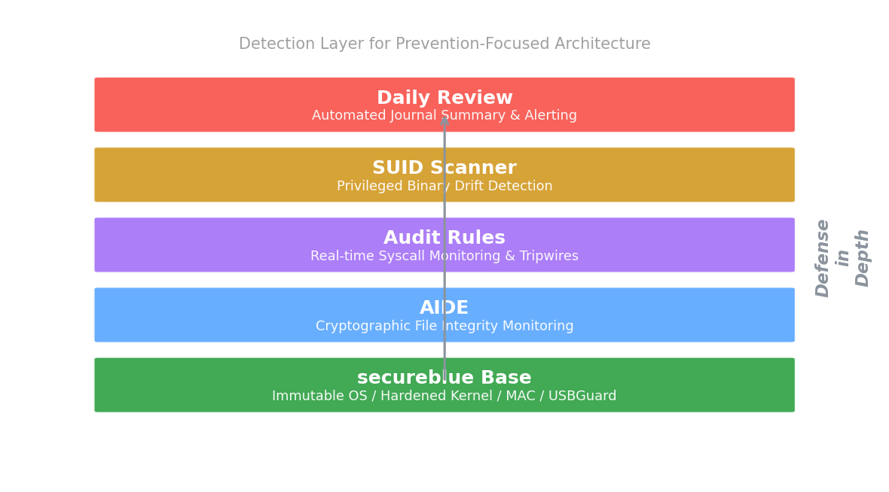

# secureblue-hids

Host intrusion detection & integrity monitoring for secureblue OS.
https://secureblue.dev/ 

This repository provides instructions to implement a complete detection layer for secureblue's prevention-focused architecture: kernel audit rules, AIDE file integrity scanning, SUID binary drift detection, tripwires & automated daily review.

**View the full guide here:** [secureblue-hids](https://x144k.github.io/secureblue-hids )

## My setup

I built this on my daily driver running secureblue on a Lenovo Legion 7 Pro (16IRX8H). Clean install, no extra overlays beyond what the guide layers. My baseline mutable SUID count was 0, which is what you want on rpm-ostree.

- **OS:** secureblue (Fedora Silverblue/Kinoite base)
- **Hardware:** Intel i9-13900HX; NVIDIA GeForce RTX 4090
- **Install type:** Clean install / Rebase from Fedora 44

## Why this exists

I noticed secureblue hardens aggressively but doesn't ship with file integrity monitoring or custom audit rules. I wanted runtime detection without weakening the security posture, so I built this stack.

Generic HIDS guides break on secureblue because they assume a traditional Linux filesystem and standard package tooling. I hit segfaults, missing commands, and PATH issues following standard guides. This one is built specifically for rpm-ostree: it handles the immutable base, overlay filesystem quirks, & secureblue's restricted execution environment.

Some may see this as scope creep. I see it as defense in depth.

### What broke for me

This is what I personally hit while building and testing this stack. Your mileage may vary.

- **AIDE segfaulted during database init.** Fedora's AIDE package is dynamically linked and conflicts with hardened_malloc. I had to build AIDE statically from source, which meant compiling nettle, pcre2, and zlib manually. Nettle 4.0 also broke AIDE 0.19.3's API; I applied a one-line patch to `src/md.c`.
- **`augenrules` threw "Old style watch rules are slower" warnings.** These are harmless but noisy. They appear because the kernel prefers syscall-based rules over legacy file watches. I kept the file watches for readability.
- **`systemctl restart auditd` is blocked by unit hardening.** secureblue intentionally refuses manual auditd restarts. I learned to use `auditctl -R` to load rules directly into the running kernel instead.
- **`systemd-resolve` flooded my privesc_suid logs.** The `auid>=1000` filter catches daemons with unset auid (`4294967295`). Kernel-level auid negation does not work for unset values, so I filter `systemd-resolve` noise at the review script level instead.

## Components

- **Audit rules:** Real-time syscall monitoring for identity stores, polkit, SSH, systemd, firewall, & canary files
- **AIDE:** Daily cryptographic filesystem integrity scan (static binary, no LD_PRELOAD bypasses)
- **SUID scanner:** Baseline & detect new privileged binaries in mutable paths
- **Canary files:** Decoy tripwires for reconnaissance detection
- **Daily review:** Automated journal summary of all security events

## Status

Functional on clean secureblue installs. See the guide for implementation.
